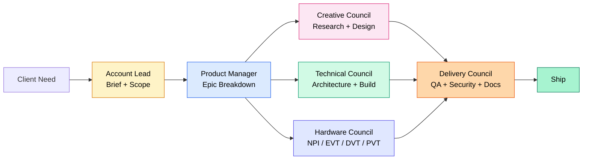
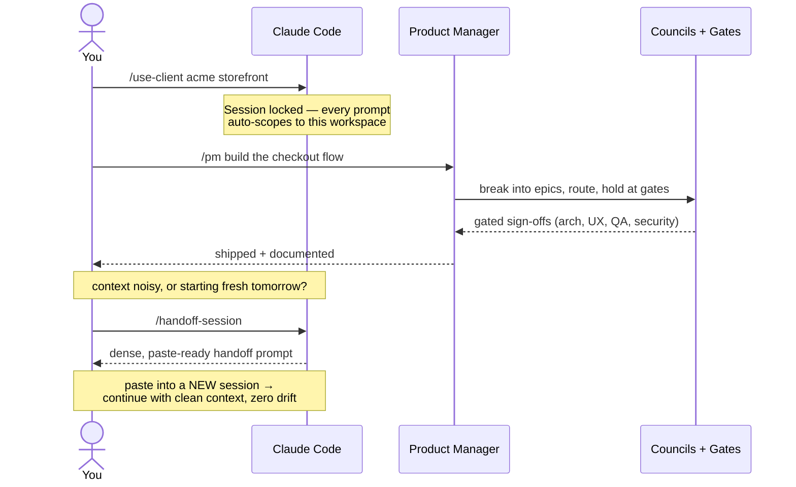
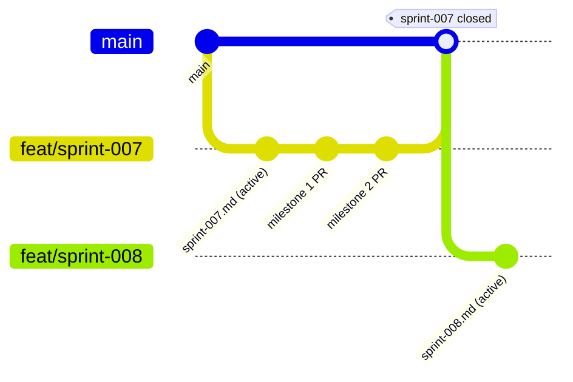

# Freelance Developer Harness

> Where vision meets execution.

[](https://github.com/10Legs/freelance-developer-harness/stargazers)
[](LICENSE)
[](https://claude.com/claude-code)

A structured agency operating system for [Claude Code](https://claude.com/claude-code). Turns one assistant into a full team — Product Manager, three councils of specialists, and enforced quality gates — that runs your client work end-to-end.

---

## What It Is

The harness is the missing org chart for AI coding agents. Out of the box, Claude Code is a brilliant generalist. Useful, but unprincipled — it will happily skip architecture review to ship faster, or run security checks last instead of first. That is not how a real agency works.

This harness installs the missing structure. A **Product Manager** owns the roadmap and routes every request through the right specialists. Four **councils** — Creative, Technical, Hardware, and Delivery — each have defined responsibilities and gates. Work flows through an automated pipeline from intake through delivery, and **non-negotiable stop-the-line gates** prevent rushing past steps that matter.

It is for solo developers running multiple client engagements, small studios that want repeatable process without hiring a PMO, and anyone building hardware-plus-software products who needs the NPI discipline of a real product company. It is not a code framework — there is no library to import. It is a set of markdown files (agents, commands, hooks, templates) that Claude Code loads automatically, plus per-client workspaces that keep every engagement cleanly isolated.

The core insight: Claude Code already supports subagents, slash commands, and event hooks. Compose them with intention and you get a full agency team that ships predictable, gated, documented work.

---

## How It Works

The Product Manager runs the pipeline. Every client need is broken into epics, routed to the right council, and held at gates until each council signs off.



**Four councils, one PM.** The PM never implements — it directs. Specialists do the work. Gates block the pipeline until quality criteria are met.

**Session-scoped client locking.** `/use-client <slug> <project>` locks a Claude Code session to one workspace. Every prompt thereafter auto-scopes to the right client, the right project, the right source root. Multiple sessions can target different clients with zero cross-contamination.

**Hooks inject context automatically.** On every prompt, hooks read your session lock and inject the active client, project, and source-root paths into the agent's context. You set the lock once per session and it follows every subsequent message.

---

## Team Roster

Twenty-five agents across four councils, all directed by the Product Manager.

```mermaid
flowchart TB
    PM[Product Manager<br/><i>Orchestrator</i>]
    AL[Account Lead<br/><i>Client Interface</i>]

    PM --> CC[Creative Council]
    PM --> TC[Technical Council]
    PM --> HC[Hardware Council]
    PM --> DC[Delivery Council]

    CC --> CD[Creative Director]
    CC --> IL[Innovation Lead]
    CC --> UX[UX Researcher]
    CC --> UI[UI Designer]

    TC --> SA[Solution Architect]
    TC --> FE[Frontend Dev]
    TC --> BE[Backend Dev]
    TC --> APE[Apple Platform Eng]
    TC --> LLM[LLM Engineer]
    TC --> BC[Blockchain Eng]
    TC --> SR[Security Reviewer]

    HC --> HPM[Hardware PM]
    HC --> ID[Industrial Designer]
    HC --> EE[Electrical Eng]
    HC --> ME[Mechanical Eng]
    HC --> FW[Firmware Eng]
    HC --> HSE[Hardware Security]
    HC --> MfE[Manufacturing Eng]
    HC --> SCS[Supply Chain]
    HC --> CS[Certification]

    DC --> TW[Technical Writer]
    DC --> QA[QA Specialist]
    DC --> GVS[GitHub & VC Specialist]

    style PM fill:#DBEAFE,stroke:#2563EB,color:#000
    style AL fill:#FEF3C7,stroke:#D97706,color:#000
    style CC fill:#FCE7F3,stroke:#DB2777,color:#000
    style TC fill:#D1FAE5,stroke:#059669,color:#000
    style HC fill:#E0E7FF,stroke:#4F46E5,color:#000
    style DC fill:#FED7AA,stroke:#EA580C,color:#000
```



| Role | Council | Responsibility |
|------|---------|---------------|
| Product Manager | *Leadership* | Owns roadmap; routes epics to councils; drives pipeline |
| Account Lead | *Leadership* | Client interface; signs briefs; manages stakeholder comms |
| Creative Director | Creative | Vision, brand, design system oversight |
| Innovation Lead | Creative | Ideation, breakthrough thinking, design sprints |
| UX Researcher | Creative | User insights, personas, journey maps, usability testing |
| UI Designer | Creative | Visual design, interaction design, prototyping |
| Solution Architect | Technical | System design, ADRs, technical governance gate |
| Frontend Developer | Technical | UI implementation, component architecture |
| Backend Developer | Technical | APIs, services, data architecture |
| Apple Platform Engineer | Technical | macOS / iOS / watchOS / tvOS; Swift, SwiftUI, AppKit, notarization |
| LLM Engineer | Technical | Inference, prompts, providers, RAG, eval |
| Blockchain Engineer | Technical | EVM chains, Solidity, Foundry; Bitcoin, Lightning, BDK |
| Security Reviewer | Technical | Threat modeling, audits, compliance sign-off |
| Hardware PM | Hardware | NPI ownership; BOM; EVT / DVT / PVT gates |
| Industrial Designer | Hardware | Form factor, ergonomics, CMF, packaging |
| Electrical Engineer | Hardware | PCB design, schematics, power, signal integrity |
| Mechanical Engineer | Hardware | Enclosures, tolerances, thermal, DFM review |
| Firmware Engineer | Hardware | MCUs, RTOS, bare-metal C/Rust, OTA |
| Hardware Security Engineer | Hardware | Secure boot, root of trust, tamper resistance, provisioning |
| Manufacturing Engineer | Hardware | DFM/DFA sign-off, CM management, yield optimization |
| Supply Chain Specialist | Hardware | BOM sourcing, lead times, EOL, tariffs |
| Certification Specialist | Hardware | FCC, CE, UL, RoHS, REACH, WEEE |
| Technical Writer | Delivery | Documentation, client deliverables, knowledge base |
| QA Specialist | Delivery | Quality gates, acceptance criteria, test automation |
| GitHub & VC Specialist | Delivery | Branch hygiene, PR review, release readiness |

---

## Directory Structure

```
freelance-developer-harness/
├── .claude/
│   ├── agents/            # 25 role definitions — each agent is a markdown persona
│   ├── commands/          # Slash commands (/pm, /intake, /sprint-plan, /retro, /mode, …)
│   ├── hooks/             # Auto-inject session context on every prompt
│   ├── sessions/          # Per-session client locks (one file per session)
│   └── settings.json      # Hook wiring + tool permissions
├── clients/
│   ├── _template/         # Blueprint for new clients (copied by /onboard-client)
│   └── <client-slug>/
│       ├── brief.md
│       ├── README.md
│       └── projects/
│           └── <project-slug>/
│               ├── specs/         # ADRs, PM summaries, architecture docs
│               ├── sprints/       # sprint-NNN.md + CURRENT symlink (per-project)
│               ├── design/        # Design briefs and assets
│               ├── deliverables/  # Client-facing outputs
│               └── qa/            # QA reports, test plans
├── patterns/              # Reusable cross-project patterns (architecture, security, design)
├── templates/             # adr.md, client-brief.md, design-brief.md, project-spec.md, sprint-plan.md
├── docs/                  # SOPs, workflows, onboarding
├── scripts/
│   ├── setup.sh                 # Interactive first-time configuration
├── CLAUDE.md              # Harness operating model — loaded automatically by Claude Code
├── AGENTS.md              # Team roster, authorities, gates, governance matrix
└── README.md
```

Source code lives **outside** the harness, in `$SOURCE_ROOT_BASE/<project-slug>/` (configured in `.env`). The harness holds intent — briefs, specs, ADRs, deliverables. The project repo holds implementation.

---

## Getting Started

```bash
# 1. Clone
git clone https://github.com/10Legs/freelance-developer-harness.git
cd freelance-developer-harness

# 2. Configure
cp .env.template .env
$EDITOR .env             # set STUDIO_NAME, SOURCE_ROOT_BASE, GITHUB_USERNAME, etc.

# 3. Run setup — patches CLAUDE.md with your studio identity
bash scripts/setup.sh

# 4. Open in Claude Code, then onboard your first client
/onboard-client acme-corp

# 5. Lock the session and start working
/use-client acme-corp storefront
/pm build the checkout flow
```

---

## Using It Day-to-Day

A normal working session: lock the workspace once, hand the PM a task, let the gates run. When context gets noisy or you want a clean slate, snapshot it and reset.



The loop is: **lock → direct → ship → hand off**. The handoff step is what keeps long-running engagements from accumulating stale or hallucinated context — instead of `/compact`, you carry forward only a verified snapshot.

---

## Key Commands

| Command | What it does |
|---------|--------------|
| `/use-client <slug> <project>` | Lock the session to a client + project (session-scoped, isolated) |
| `/onboard-client <slug>` | Create a new client workspace from the template |
| `/pm <task>` | Run the PM end-to-end on a task; spawns the right agents and walks the gates |
| `/pm on` / `/pm off` | Toggle persistent PM mode — every subsequent prompt is auto-routed |
| `/mode` | Toggle permission mode (default / acceptEdits / plan / bypass) for the active session |
| `/intake` | Structured intake for a new piece of work — PM produces a delegation plan |
| `/kickoff` | Full project kickoff: discovery, scope, initial backlog |
| `/sprint-plan` | Plan the next sprint into `clients/.../sprints/sprint-NNN.md` and repoint `CURRENT` |
| `/retro` | Close the active sprint: stamp closed_date, write retro into the sprint file |
| `/arch-review` | Architecture review with Solution Architect as gate |
| `/design-review` | Design review with Creative Director + UX gates |
| `/ideate` | Structured ideation session led by Innovation Lead |
| `/client-report` | Generate a client status report |
| `/handoff-session` | Snapshot the session into a paste-ready handoff prompt (auto-copied to clipboard) for a clean context reset |

---

## Workflow Gates

Six **non-negotiable stop-the-line gates** keep work honest. If any gate blocks, the pipeline stops — no working around them.

```mermaid
stateDiagram-v2
    direction LR
    [*] --> Intake
    Intake --> Scoped: Brief signed (Account Lead)
    Scoped --> Architected: Scope approved (PM)
    Architected --> Designed: Architecture signed off (Solution Architect)
    Designed --> Built: Design validated (UX Researcher)
    Built --> Verified: QA approved (QA Specialist)
    Verified --> Shipped: Security signs off (Security Reviewer)
    Shipped --> [*]
```



Each transition is a gate: work cannot advance to the next state until the named role signs off. A blocked gate halts the whole pipeline — the PM surfaces the blocker and routes around it or escalates.

1. **No client work starts without a signed brief.** Account Lead owns this.
2. **No work is scoped or delegated without PM approval.** PM owns prioritization and routing.
3. **No implementation without architecture sign-off.** Solution Architect reviews every system design.
4. **No design handoff without UX validation.** UX Researcher must validate against user research.
5. **No delivery without QA approval.** QA Specialist owns the final quality gate.
6. **No public-facing work without Security review.** Security Reviewer signs off on every release.

For hardware projects, the NPI pipeline adds: **DFM feasibility**, **EVT pass**, **DVT pass + BOM lock**, **Certification clearance**, and **PVT yield target**.

Collapsible roles: for tiny engagements, Account Lead can collapse into PM, and Technical Writer can collapse into developer roles.

---

## Sprint Tracking

Each project owns its own sprint history under `clients/<client>/projects/<project>/sprints/`. Sprints are sequentially numbered and never cross project boundaries.



Convention:

```
clients/<client>/projects/<project>/sprints/
  sprint-001.md
  sprint-002.md
  ...
  CURRENT -> sprint-NNN.md     # symlink to the active sprint
```

- `/sprint-plan` auto-detects the next number, creates `sprint-NNN.md` from the template, and repoints `CURRENT`.
- `/retro` reads `CURRENT`, stamps `status: closed` and `closed_date`, and writes the retrospective into the same sprint file (no separate retro doc).
- The sprint file contains frontmatter (status, dates, goal), a milestone table, the backlog with PR links, risks, definition of done, and an embedded retrospective section.

This is the only source of sprint truth. Specs, ADRs, and PM summaries continue to live in `specs/`.

---

## Contributing

Issues, ideas, and pull requests are welcome.

- **Discussions before code.** For new agents, councils, or workflow changes, open a Discussion or Issue first so the design can be debated before implementation.
- **Follow the harness rules.** Branch for every change. Never commit to `main` directly. PRs require a clean CI check (including PII guard).
- **Respect the agent boundary.** Agent definitions are intentional personas with hard rules — propose changes in an Issue rather than rewriting them silently.
- **No client data.** The public repo holds template and demo material only. Real client briefs, source paths, and credentials never appear here.
- **License.** MIT — see [LICENSE](LICENSE).

---

*Built for [Claude Code](https://claude.com/claude-code) by [10Legs](https://github.com/10Legs).*
